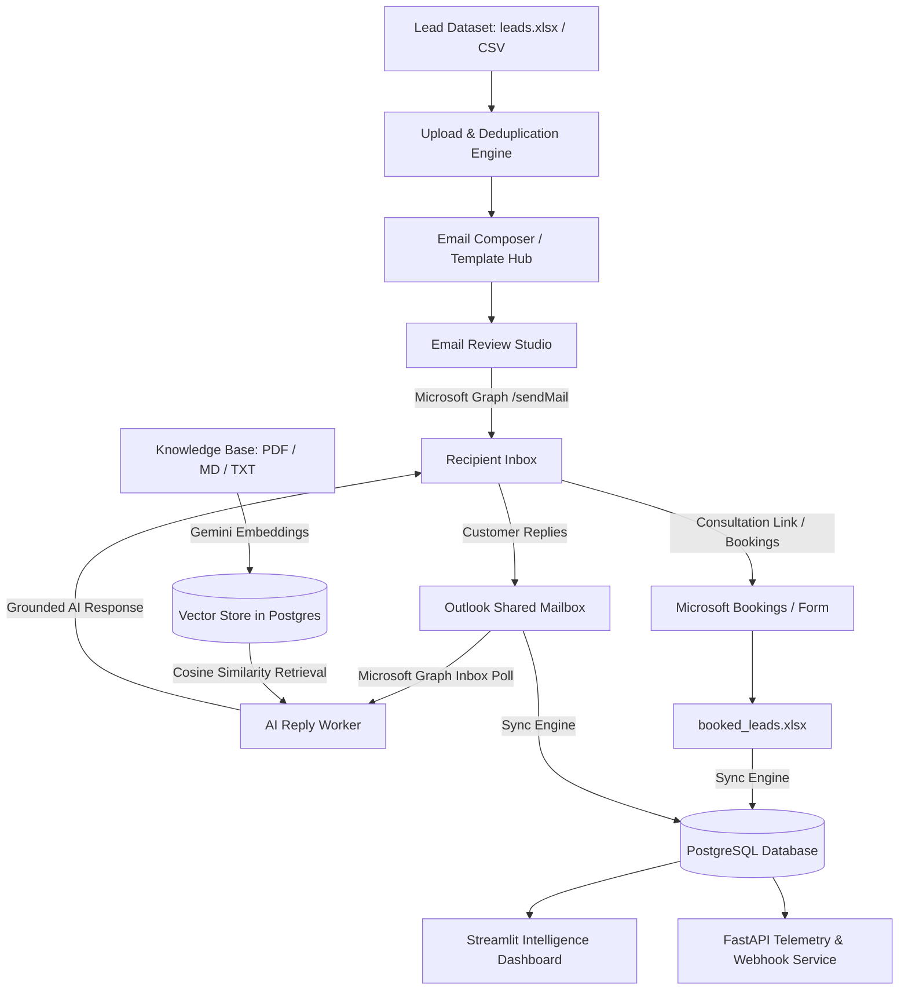

# AINeotechnology — Lead Outreach & Intelligence Suite

An enterprise-grade, end-to-end automated lead re-engagement, email intelligence, and appointment booking platform powered by **FastAPI**, **Streamlit**, **LangGraph**, **Google Gemini**, and **Microsoft 365 (Microsoft Graph)**.

---

## 🌟 Key Capabilities

1. **Executive Streamlit Control Center**:
   - **Pipeline Overview**: Real-time KPI cards, interactive funnel tracking conversion velocity from stale leads to confirmed calendar appointments, and chronological activity stream.
   - **Analytics & Telemetry**: 14 comprehensive analytics engines covering email open tracking, link click tracking, reply detection, bounce detection, opt-out handling, time-to-response velocity, engagement scoring, sentiment analysis, and best-time send optimization.
   - **Template Review & Hub**: 7 responsive corporate HTML email templates with live mobile/desktop email client previews, engagement benchmarks, personalization tags, and batch draft creation.
   - **Upload & Draft**: Drag-and-drop CSV/Excel lead ingestion with automatic header matching, deduplication against previously contacted leads, and 1-click draft generation.
   - **Leads Directory**: Master lead database with multi-parameter filtering, search by company/name/email, and outreach status inspection.
   - **Email Review Studio**: Human-in-the-loop review studio with live Outlook/Apple Mail email client preview, instant personalization tag interpolation, 1-click template reset, and single or bulk dispatch via Microsoft Graph.
   - **Replies & Bookings**: Inbound conversation monitoring, customer inquiry reconciliation with permanent Excel archives, interactive RAG document ingestion, and cosine-similarity testing playground.

2. **RAG Knowledge Base & Autonomous Reply Agent**:
   - Continuous Outlook inbox monitoring via Microsoft Graph API.
   - Company knowledge (PDF, Markdown, TXT) parsed, chunked, and embedded into dense vectors using Google Gemini embeddings.
   - Cosine-similarity retrieval (min-score filtered) grounds outbound replies in factual company capabilities, pricing, and service offerings.
   - Automatic classification of lead reply intent (Interested, Question, Meeting Request, Reschedule, Opted Out).

3. **Multi-Source Synchronization & Permanent Archives**:
   - Real-time two-way synchronization between **Outlook** (customer replies), **Excel** (`booked_leads.xlsx` via Microsoft Bookings / Power Automate / Odoo CRM flows), and **PostgreSQL**.
   - Permanent offline Excel loggers ensuring audit trails and offline reporting continuity.

4. **Production Architecture & Performance**:
   - In-memory smart caching with file-mtime awareness for sub-millisecond local reads.
   - Batch database query operations eliminating N+1 remote query latency.
   - Dual theme system with instant CSS compilation caching (Dark & Light modes).
   - Autonomous background Render keepalive daemon preventing cold-start spin downs.

---

## 🏛️ Architecture Overview



### Module Breakdown

| Directory / File | Description |
|---|---|
| `dashboard.py` | Primary Streamlit application orchestrating all 7 executive modules, live sync, and theme controls. |
| `analytics_view.py` | Specialized analytics visualizer rendering 14 telemetry features, conversion charts, and export actions. |
| `template_hub_view.py` | Template Hub interface with live HTML sandboxing, tag interpolation, and batch drafting. |
| `main_api.py` | FastAPI application runner for webhook endpoints, telemetry tracking, and keepalive probes. |
| `reply_worker.py` | Autonomous background daemon polling Outlook inbox, querying RAG knowledge, and answering leads. |
| `worker.py` | Command-line batch outreach runner for automated pipeline workflows. |
| `seed_knowledge_base.py` | CLI utility to index `.md`, `.pdf`, and `.txt` files from `knowledge_base/` into the database. |
| `Backend/api.py` | FastAPI routes for open tracking pixels, link redirects, unsubscribe handling, and health probes. |
| `Backend/crud.py` | High-performance batched database queries, deduplication logic, and synchronization routines. |
| `Backend/db.py` | SQLAlchemy engine with connection pooling and automated schema migration handling. |
| `Backend/models.py` | Database schema definitions (`CampaignLog`, `KnowledgeDocument`). |
| `Backend/keepalive.py` | 24/7 self-healing keepalive daemon keeping cloud deployments warm. |
| `Email/outlook_mailer.py` | Microsoft Graph API client for sending emails via OAuth app-only credentials. |
| `Email/templates.py` | Deterministic transactional and meeting notification templates. |
| `Email/draft_options.py` | High-converting executive email templates with responsive card layouts and CDN assets. |
| `services/rag.py` | Text chunking, Gemini vector embeddings, and cosine similarity retrieval engine. |
| `services/template_service.py` | Template registry, responsive HTML compilers, and lead placeholder interpolator. |
| `services/analytics_service.py` | Analytical aggregation engine calculating KPIs, rates, scores, and timelines. |
| `services/analytics_export.py` | Professional PDF (ReportLab) and multi-sheet Excel report generators. |
| `services/excel_logger.py` | Permanent Excel record append and synchronization utilities. |
| `utils/microsoft_auth.py` | MSAL authentication wrapper managing token acquisition and caching. |
| `utils/theme.py` | Modern dual-theme CSS design system with Outfit, Inter, and JetBrains Mono typography. |

---

## 🚀 Quickstart & Setup

### 1. Prerequisites
- **Python**: Version 3.10 to 3.14
- **Database**: PostgreSQL (e.g., Supabase, Neon, AWS RDS, or local PostgreSQL) or SQLite fallback
- **Microsoft 365 Tenant**: With an Azure AD App Registration (Application permissions)
- **Google AI API Key**: For Gemini LLM and dense vector embeddings

### 2. Installation

Clone the repository and install dependencies:

```bash
git clone <repository-url>
cd lead
python -m venv .venv
# Windows PowerShell:
.venv\Scripts\Activate.ps1
# Linux / macOS:
source .venv/bin/activate

pip install -r requirements.txt
```

### 3. Environment Configuration

Copy the example environment configuration:

```bash
cp .env.example .env
```

Configure your `.env` file with the appropriate credentials (placeholders shown below):

```ini
# --- Lead Dataset ---
LEADS_FILE=leads.xlsx
STALE_AFTER_DAYS=90
CAMPAIGN_NAME=q3_stale_lead_reengagement

# --- Database ---
DATABASE_URL=postgresql+psycopg2://<username>:<password>@<host>:5432/<database>?sslmode=require

# --- API & Application Endpoints ---
API_BASE_URL=https://your-api-domain.com/
PORT=8000

# --- LLM & RAG (Google Gemini) ---
LLM_PROVIDER=gemini
GEMINI_API_KEY=your_gemini_api_key_here
GEMINI_MODEL=gemini-2.5-flash
EMBEDDING_MODEL=models/gemini-embedding-001

# --- Email Services (Microsoft 365 / Outlook / Graph API) ---
EMAIL_PROVIDER=outlook
MS_TENANT_ID=your_azure_ad_tenant_id
MS_CLIENT_ID=your_azure_ad_client_id
MS_CLIENT_SECRET=your_azure_ad_client_secret
MS_SENDER_EMAIL=support@yourcompany.com
CONTACT_EMAIL=sales@yourcompany.com
CONTACT_PHONE=1234567890

# --- Meeting Booking URL (Microsoft Bookings) ---
BOOKING_FORM_URL=https://bookings.cloud.microsoft/book/yourcompany@example.com/

# --- Scheduling Preferences ---
OFFICE_HOURS_TZ=Asia/Kolkata
OFFICE_HOURS_START=09:00
OFFICE_HOURS_END=18:00
OFFICE_HOURS_DAYS=0,1,2,3,4
MEETING_DURATION_MINUTES=30
AVAILABILITY_LOOKAHEAD_DAYS=14
```

### 4. Azure AD App Registration (Microsoft Graph)

1. Navigate to the **Azure Portal** (`portal.azure.com`) -> **Microsoft Entra ID** -> **App registrations** -> **New registration**.
2. Under **Certificates & secrets**, create a new client secret and record the value as `MS_CLIENT_SECRET`.
3. Under **API permissions** -> **Add a permission** -> **Microsoft Graph** -> **Application permissions**, add:
   - `Mail.Send` (to dispatch emails through the shared mailbox)
   - `Mail.Read` (to monitor incoming replies from leads)
   - `Calendars.ReadWrite` (to inspect availability and schedule meetings)
4. Click **Grant admin consent for your organization**.

---

## 💻 Running the Application

### Recommended Workflow: UI Control Center

Start the FastAPI telemetry server and Streamlit dashboard in two separate terminal sessions:

**Terminal 1 — FastAPI Server:**
```powershell
python main_api.py
```

**Terminal 2 — Streamlit Dashboard:**
```powershell
streamlit run dashboard.py
```

Access the dashboard in your browser at `http://localhost:8501`.

### Background Automation Workers

To run autonomous background processing without the dashboard open:

```powershell
# Continuous Outlook inbox scanning & RAG-grounded auto-replies (runs every 30 seconds):
python reply_worker.py --interval 30

# Single inbox scan and exit:
python reply_worker.py --once

# Batch campaign outreach from stale leads dataset:
python worker.py

# Standalone 24/7 Render keepalive worker:
python keepalive_worker.py --interval 540
```

---

## 🧭 Step-by-Step Operator Guide

1. **Upload Leads**:
   - Open **Upload & Draft** (`?page=upload`).
   - Drag and drop your `.xlsx` or `.csv` lead sheet. The engine automatically identifies columns (`email`, `name`, `company`, `lead_id`, etc.) and calculates deduplication counts.
   - Select your desired template design from the dropdown.
   - Click **Generate AI Drafts & Open Email Review**.
2. **Review & Dispatch**:
   - In **Email Review Studio** (`?page=email`), inspect the draft in the live Outlook client preview.
   - Edit the subject line or message body if needed, or switch templates with 1-click.
   - Click **Approve & Send** to dispatch individually, or scroll to the bottom for **Bulk Approve & Send Remaining**.
3. **Monitor Inbound Replies & Bookings**:
   - In **Replies & Bookings** (`?page=replies`), click **Check Inbox & Auto-Reply Now** or activate the background daemon.
   - Inbound replies from outreach leads are retrieved, classified for intent, matched against RAG vector documents, and answered automatically.
   - Verified consultation appointments sync into the database and are permanently recorded in `booked_leads.xlsx`.
4. **Knowledge Base Management**:
   - Under **Replies & Bookings** -> Tab 2 (**RAG Knowledge Base & Attachments**), upload company service decks or policies (`.pdf`, `.md`, `.txt`).
   - Use the **Interactive RAG Grounding Playground** to test vector retrieval scores and inspect sample responses.
5. **Analytics & Performance Reports**:
   - Open **Analytics** (`?page=analytics`) to monitor delivery rates, open rates, click-through rates, and engagement distribution.
   - Export publication-ready PDF executive dossiers or comprehensive multi-sheet Excel workbooks anytime.

---

## ⚡ Performance & Optimization Highlights

- **Zero-Delay Theme Switching**: Master CSS compilation is cached using Least Recently Used (LRU) in-memory storage, eliminating string compilation delays during theme switches.
- **Batched Database Synchronizations**: Background Excel and Outlook synchronizations leverage bulk SQL `IN (...)` queries and atomic commits, eliminating N+1 network queries over cloud database pools.
- **Smart Disk Cache with MTime Validation**: Excel parsing results are cached and automatically invalidated only when file modification timestamps change on disk, reducing disk read latency by up to 98%.
- **Fast Deduplication**: Pre-send duplicate validation checks execute in-memory against active session records, avoiding synchronous remote network roundtrips.

---

## 🔒 Security & Best Practices

- **Strict Environment Isolation**: Never commit `.env` or files containing secret keys to version control. Keep `.env` listed in `.gitignore`.
- **Pre-Send Deduplication**: The system enforces multi-tier deduplication guards preventing duplicate outreach to the same recipient across database history, active drafts, and sheet flags.
- **Safe HTML Sanitization**: Email previews run in isolated sandboxes to prevent script injection or DOM style pollution.
- **Zero Hallucination RAG Threshold**: Vector retrieval enforces a strict similarity threshold (`0.35`) so that off-topic customer messages do not retrieve irrelevant corporate facts.

---

## 📄 License

This project is licensed under the MIT License. See [LICENSE](LICENSE) for details.
